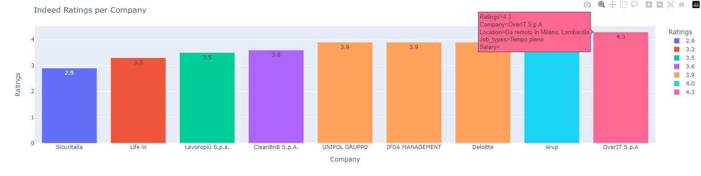
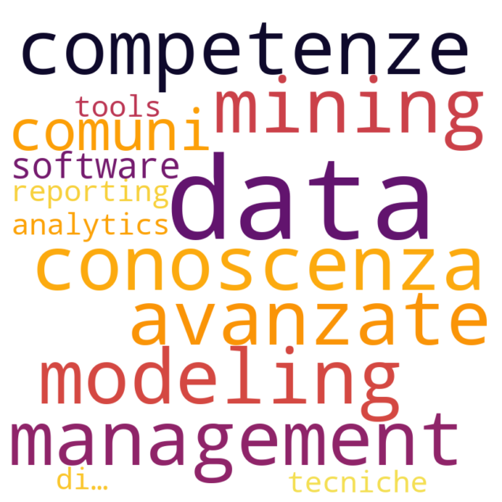
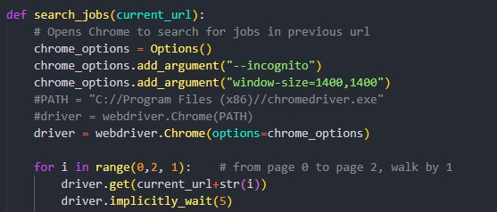

# Web Scraping and Analysis Tool

This project is a web scraping and analysis tool that was built with the intent of practicing the Selenium and BeautifulSoup packages.

The project is divided into two parts:

1. Scraper scripts that focus on two specific tasks: scraping job data from Indeed and scraping content from Wikipedia.
2. An analysis script that retrieves the scraped data for analysis purposes.

## Table of Contents
1. [Introduction](#introduction)
2. [Setup](#setup)
3. [Indeed Scraper](#indeed-scraper)
4. [Wikipedia Scraper](#wikipedia-scraper)
5. [Analysis](#analysis)
6. [Usage](#usage)
7. [Contributing](#contributing)
<!-- 8. [License](#license) -->

## Introduction

#### 🔻 What is web scraping? 

Web scraping is the process of extracting data from websites.

#### 🔻 Why is it needed in this project?

In this project, we utilize web scraping techniques to gather job data from Indeed, a popular job listing website, and content from Wikipedia for natural language processing purposes.

#### 🚩 What is the purpose?

The collected data can be used for various purposes such as analysis, visualization, or research.

## Setup
To use this tool, make sure you have the following dependencies installed:
- Python 3.x
- Requests (`requests`)
- Beautiful Soup (`beautifulsoup4`)
- Selenium (`selenium`)
- nklt (`nklt`)
- plotly (`plotly`)
- wordcloud (`wordcloud`)

## 💼 Indeed Scraper
The Indeed scraper is designed to extract job postings from Indeed based on specific search criteria (type of work, location).
 It uses the BeautifulSoup library to parse the HTML structure of the search results page and retrieves relevant job details such as title, company, location, salary, and job description. The scraper supports pagination, allowing you to retrieve multiple pages of results.

## 📚 Wikipedia Scraper
The Wikipedia scraper allows you to extract all programming languages from Wikipedia page. 

## 📊 Analysis
After collecting data from Indeed and Wikipedia, the perfomed analysis are:

1. 📈 Ratings comparison: Compare ratings across different job postings to see the differences or correlations between companies, locations, type of jobs.

2. 💬 Natural language processing: Apply text analysis techniques to job descriptions to extract keywords, perform sentiment analysis, or identify patterns.

3. 👩🏻‍💻 Natural language processing to job descriptions to connect with Wikipedia programming languages to extract the most requested ones.

Furthers analysis that could be used are:
- Salary comparison: Compare salaries across different job postings to gain insights into salary ranges and variations.
- Job market trends: Analyze the scraped job data from Indeed to identify trends in specific industries, job titles, or locations.

## Usage
To use the web scraping and analysis tool, follow these steps:

1. Run only Analysis.py. First onfigure the search parameters for the Indeed scraper, such as the job title and location.

2. Run the Indeed scraper to collect job data from Indeed.
    !Important if you want to search for more jobs (scraper will make the execution slower) you need to modify the parameters in this for loop (for example from page 1 to 5 walking by 1 will take about 5-10 minutes)
    

3. Run the Wikipedia scraper to collect programming languages from Wikipedia/Other websites (execution time: 2 minutes).

4. Perform analysis on the obtained data using your preferred analysis techniques.

## Contributing
Contributions to this project are welcome! If you have any suggestions, bug reports, or improvements, please submit a pull request or open an issue on the project's GitHub repository.

<!-- ## License
This project is licensed under the [MIT License](LICENSE). Feel free to use and modify the code for your own purposes. -->
